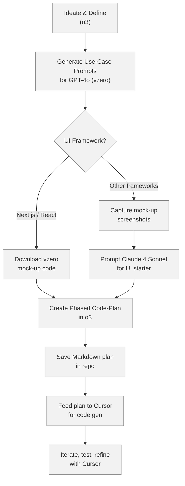

# AI-Assisted Code Generation Workflow

```mermaid
flowchart TD
    A["Ideate &amp; Define<br/>(o3)"] --> B["Generate Use-Case Prompts<br/>for GPT-4o (vzero)"]
    B --> C{"UI Framework?"}

    C -->|Next.js / React| D["Download vzero<br/>mock-up code"]
    C -->|Other frameworks| E["Capture mock-up<br/>screenshots"]

    E --> F["Prompt Claude 4 Sonnet<br/>for UI starter"]
    D --> G["Create Phased Code-Plan<br/>in o3"]
    F --> G
    G --> H["Save Markdown plan<br/>in repo"]
    H --> I["Feed plan to Cursor<br/>for code gen"]
    I --> J["Iterate, test, refine<br/>with Cursor"]

    classDef step fill:#f2f2f2,stroke:#888,stroke-width:1px,rounded-corners;
    class A,B,C,D,E,F,G,H,I,J step;
```
